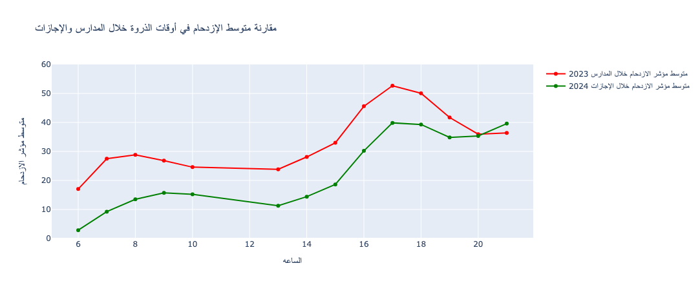
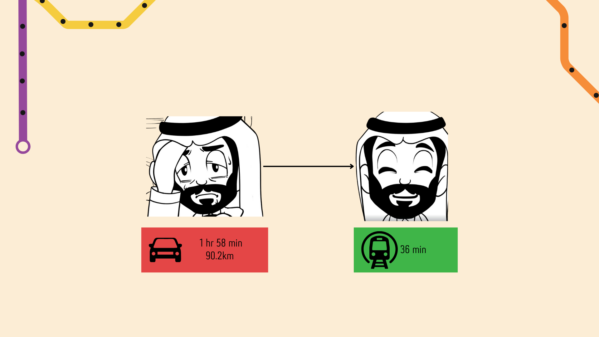
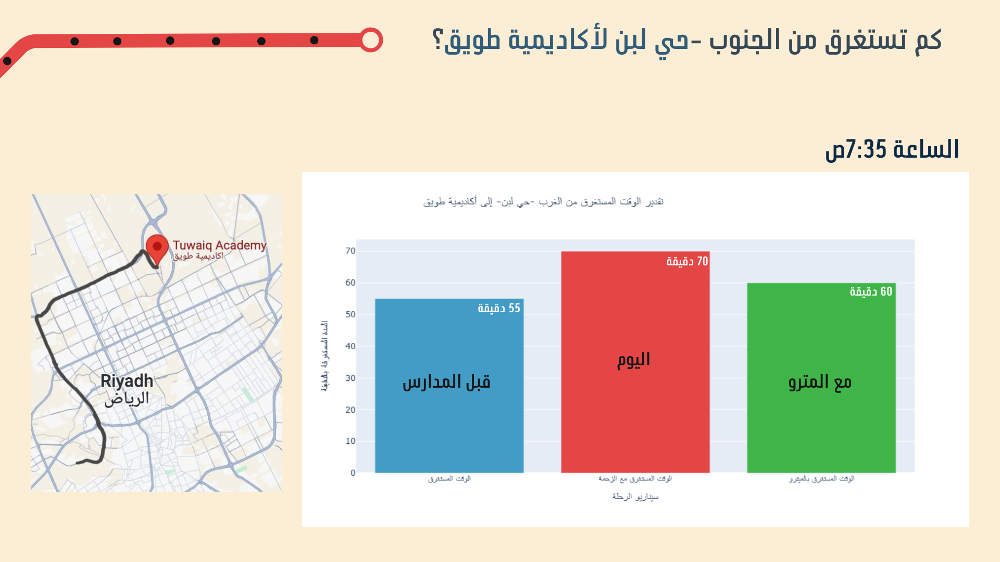
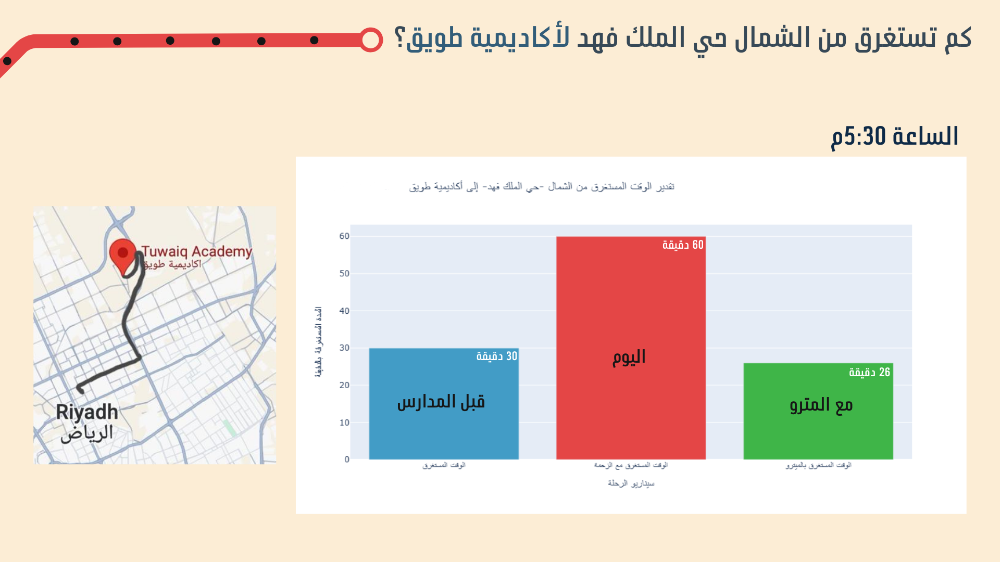
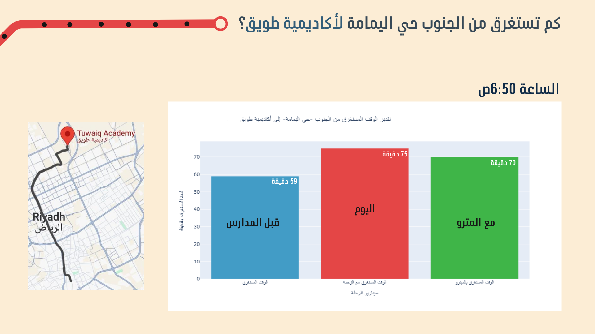

# 🚇 Estimating the Impact of the Riyadh Metro on Traffic:
 Tuwaiq Data Science & Machine Learning Bootcamp Capstone

## 🚨 Problem Statement
As Riyadh prepares for the launch of its metro system, a major question arises: Will the new metro significantly reduce the city's chronic traffic congestion? Our project aims to estimate the effect of this transformative public transport system on Riyadh’s traffic flow, focusing on how it can affect the pressure on key roads, especially during peak hours.

## 🌟 Introduction
Riyadh, the heart of Saudi Arabia, faces growing traffic challenges as the city's population and number of vehicles increase. The introduction of the Riyadh Metro is expected to reshape daily commutes and ease the burden on the road network. Our project explores the potential impact of the metro on reducing traffic congestion, using data-driven approaches and estimate its effects on travel times, congestion, and overall traffic behavior.

## 📊 Data Collection
What data do wee need for our analysis? We need traffic and metro data to find the effect between them, for the traffic data a Data Engineer called Majed Alhulayel, helped us, he was extracting traffic data from December 2022 till now using TomTom platfomr! For the metro data, we couldn't find anything but a pdf map in the RCFRC website, so we had to build the data from scratch by ourselves and make sure of it from their map.  

## 💡 Key Insights
Have you ever thought about how much difference the timing of school versus vacation can make on traffic patterns? 
Imagine how the 6 a.m. hour drastically shifts the flow of someone's day!

-Now, imagine a father named Abo-Nasser, who recently moved to Riyadh. He lives in Alsaadah neighborhood and has two children—one son attending King Saud University and a daughter at Tuwaiq Academy. Abo-Nasser works at King Khalid Airport, and every day he drives his children to their schools before heading to work. His total travel time is an exhausting 1 hour and 58 minutes! How many people like Abo-Nasser are navigating these same traffic challenges?
-We estimate that Abo-Nasser’s experience could improve in two possible ways once the metro is operational:
1. If Abo-Nasser uses the metro, potentially cutting down his travel time to more than half of the time!

 
 
2. If others use the metro, freeing up road space for those who still prefer driving.
   If we have 5000 people who will use the metro, how many cars will empty the streets? A lot!
   Here are examples of going from different directions to Tuwaiq Academy ;)
   
    
    
    

We will continue to analyze how the metro can reduce traffic and assess whether our estimations align with the real impact once the metro becomes operational.

- [Demo](https://drive.google.com/file/d/1wlVU4vwrZR6upoIIeheAlFFtDJWHVOH3/view?usp=sharing)

## 👥 Team Members
- [Hatoon Aloqaily](https://www.linkedin.com/in/hatoon-al-oqaily-73b808253?utm_source=share&utm_campaign=share_via&utm_content=profile&utm_medium=android_app)
- [A'laa Alahmadi]()
- [Raghad Almalki]()
- [Saraa Almudyfer](https://www.linkedin.com/in/sarraa-almudayfir-05918b265?utm_source=share&utm_campaign=share_via&utm_content=profile&utm_medium=ios_app)
- [Wadiah Albuhairy](https://www.linkedin.com/in/wadiah-al-buhairi-336306181?utm_source=share&utm_campaign=share_via&utm_content=profile&utm_medium=ios_app)

Together, we’re driving towards a smarter, more efficient Riyadh! 🚋
